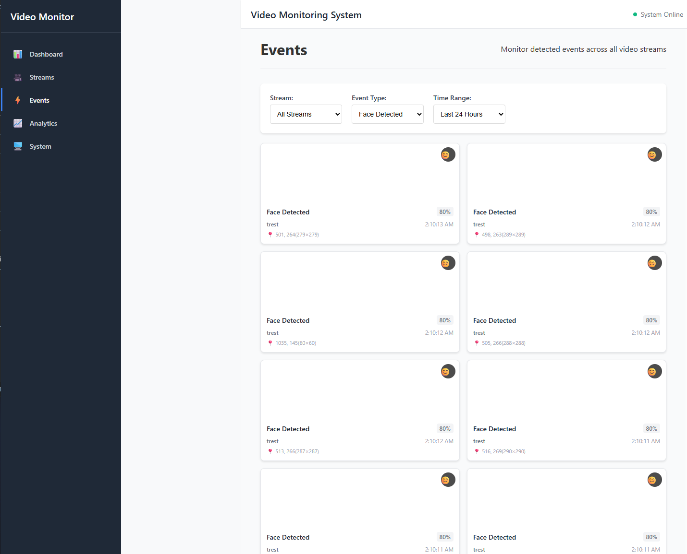

# VideoMonitoring

A comprehensive dockerized video monitoring system with object detection clipping functionality, SQLite for data storage, Python for processing, and Docker for containerization.

## Features

- **Live Video Stream Processing**: Real-time video ingestion from multiple sources (RTSP, webcam, file)
- **Motion Detection**: Automated motion detection with configurable sensitivity
- **Object Detection**: Basic object detection and tracking with clipping functionality
- **Object Clipping**: Automatically extracts and saves detected objects as separate image clips
- **React Frontend**: Modern web interface for stream management and event review
- **REST API**: Full REST API for stream management and data retrieval
- **System Monitoring**: Real-time system metrics and performance monitoring
- **Event Storage**: Automatic event detection, frame capture, and object clipping
- **Scalable Architecture**: Docker-based deployment with simplified SQLite storage

## Architecture

```
┌─────────────────┐    ┌─────────────────┐    ┌─────────────────┐
│   Video Streams │───▶│  Video Monitor  │───▶│     SQLite      │
│  (RTSP/Webcam)  │    │   (FastAPI)     │    │   (Database)    │
└─────────────────┘    └─────────────────┘    └─────────────────┘
                                │                        
                                ▼                        
                       ┌─────────────────┐    ┌─────────────────┐
                       │ React Frontend  │    │  File Storage   │
                       │   (Port 3000)   │    │ (Frames/Clips)  │
                       └─────────────────┘    └─────────────────┘
```

## Quick Start

1. **Clone the repository**:
   ```bash
   git clone https://github.com/muldercw/VideoMonitoring.git
   cd VideoMonitoring
   ```

2. **Start the system**:
   ```bash
   docker-compose up -d
   ```

3. **Access the application**:
   - Frontend Interface: http://localhost:3000
   - API Documentation: http://localhost:8000/docs
   - Health Check: http://localhost:8000/health

## API Endpoints

### Stream Management
- `POST /streams` - Create new video stream
- `GET /streams` - List all streams
- `GET /streams/{stream_id}` - Get stream details
- `POST /streams/{stream_id}/start` - Start stream processing
- `POST /streams/{stream_id}/stop` - Stop stream processing
- `DELETE /streams/{stream_id}` - Delete stream

### Analytics & Events
- `GET /streams/{stream_id}/analytics` - Get stream analytics
- `GET /streams/{stream_id}/events` - Get stream events
- `GET /events` - Get all events with optional filtering
- `GET /api/frames/{frame_path}` - Serve frame images
- `GET /api/clips/{clip_path}` - Serve object clip images
- `GET /system/metrics` - Get system metrics
- `GET /dashboard/summary` - Get dashboard summary

## Configuration

Environment variables can be configured in `docker-compose.yml`:

```yaml
environment:
  - DATABASE_URL=sqlite:///video_monitoring.db
  - PYTHONUNBUFFERED=1
  - REACT_APP_API_URL=http://localhost:8000
```

## Testing

Run the test suite:
```bash
python test_system.py
```

## Development

### Local Development
```bash
# Install dependencies
pip install -r requirements.txt

# Run the backend
python app.py

# Run the frontend (in another terminal)
cd frontend
npm install
npm start
```

### Adding New Features
1. Update database models in `src/models.py`
2. Add processing logic in `src/video_processor.py`
3. Update API endpoints in `app.py`
4. Add tests in `test_system.py`

## Database Schema

### Tables
- `video_streams` - Stream configuration and metadata
- `video_events` - Event data with object clips and frame paths
- `video_analytics` - Performance and quality metrics
- `system_metrics` - System resource usage

### Object Clipping
- Detected objects are automatically extracted from frames
- Object clips are saved as individual image files
- Clip paths are stored in the database for easy retrieval
- Frontend displays clips in event cards for enhanced review

## Monitoring

The system provides comprehensive monitoring:
- Real-time stream status
- System resource usage
- Processing performance metrics
- Event detection statistics

## Contributing

1. Fork the repository
2. Create a feature branch
3. Make your changes
4. Add tests
5. Submit a pull request

## Screenshots

### Dashboard Tab


### Streams Management Tab


### Events Review Tab


### Analytics Tab


### System Monitoring Tab


## License

This project is licensed under the MIT License.
